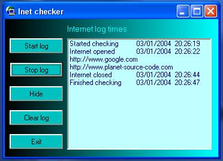



## internet log, logs when internet opened/closed and where visited

### Description

also goes to systray and creates a .txt file to hdd with the log, did it to keep an eye on what pages my kids where visiting, you never know what they are upto lol.
 
### More Info
 

             |
---                |---
**Submitted On**   |2004-01-03 16:31:02
**By**             |[stephen whittle](https://github.com/Planet-Source-Code/PSCIndex/blob/master/ByAuthor/stephen-whittle.md)
**Level**          |Beginner
**User Rating**    |4.8 (24 globes from 5 users)
**Compatibility**  |VB 6\.0
**Category**       |[Files/ File Controls/ Input/ Output](https://github.com/Planet-Source-Code/PSCIndex/blob/master/ByCategory/files-file-controls-input-output__1-3.md)
**World**          |[Visual Basic](https://github.com/Planet-Source-Code/PSCIndex/blob/master/ByWorld/visual-basic.md)
**Archive File**   |[internet\_l169005132004\.zip](https://github.com/Planet-Source-Code/stephen-whittle-internet-log-logs-when-internet-opened-closed-and-where-visited__1-50761/archive/master.zip)

